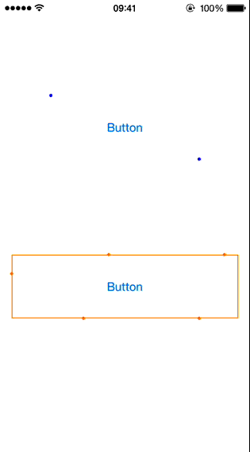

# JTBorderDotAnimation

[](https://travis-ci.org/jonathantribouharet/JTBorderDotAnimation)


JTBorderDotAnimation is a simple animation for have dots turning around a UIView on iOS.

## Installation

With [CocoaPods](http://cocoapods.org/), add this line to your Podfile.

	pod 'JTBorderDotAnimation', '~> 1.0'

## Screenshots



## Usage

### Basic usage

Just import `JTBorderDotAnimation.h`.

```objective-c
#import "JTBorderDotAnimation.h"

@interface ViewController : UIViewController

@property (weak, nonatomic) IBOutlet UIView *animatedView;

@property (strong, nonatomic) JTBorderDotAnimation *dotAnimation;

@end
```

Assign the view you want to animate and start the animation.

```objective-c
- (void)viewDidLoad
{
    [super viewDidLoad];
 
    self.dotAnimation = [JTBorderDotAnimation new];
    self.dotAnimation.animatedView = self.animatedView;
}

- (void)viewDidAppear:(BOOL)animated
{
    [super viewDidAppear:animated];

    [self.dotAnimation start];
}
```

### Customization

You can easily customize the animation.

- `numberPoints`
- `duration`
- `repeatCount`
- `pointSize`
- `pointColor`

Example:

```objective-c
- (void)viewDidLoad
{
    [super viewDidLoad];
 
    self.dotAnimation = [JTBorderDotAnimation new];
    self.dotAnimation.animatedView = self.animatedView;

    self.dotAnimation.numberPoints = 6;
    self.dotAnimation.duration = 6.;
    self.dotAnimation.repeatCount = 3;
    self.dotAnimation.pointSize = 5.;
    self.dotAnimation.pointColor = [UIColor orangeColor];
}
```

### Notes

`clipsToBounds` property of the animatedView is set to `NO` at the beginning of the animation.

You can also change the speed of the animation without stopping it with:

```objective-c
    CALayer *layer = self.animatedView.layer;
    
    layer.timeOffset = [layer convertTime:CACurrentMediaTime() fromLayer:nil];
    layer.beginTime = CACurrentMediaTime();
    layer.speed = 2.;
```

## Requirements

- iOS 7 or higher
- Automatic Reference Counting (ARC)

## Known Issues

- Animation stop when the application go in background, you have to restart it manually

## Author

- [Jonathan Tribouharet](https://github.com/jonathantribouharet) ([@johntribouharet](https://twitter.com/johntribouharet))

## License

JTBorderDotAnimation is released under the MIT license. See the LICENSE file for more info.
